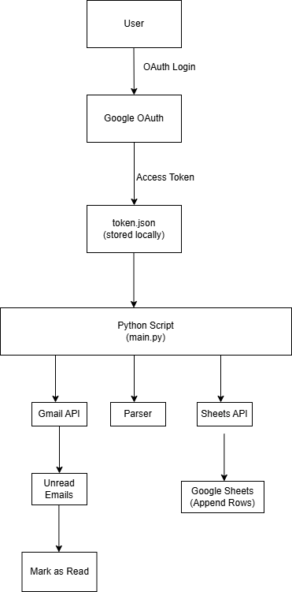

# Gmail to Google Sheets Automation

This project automates the process of fetching unread emails from Gmail and logging them into a Google Sheet using Google APIs and OAuth 2.0 authentication. The script ensures that emails are processed only once and prevents duplicate entries.

---

# 1. High Level Architecture



## Features

- Authenticates users securely using OAuth 2.0
- Fetches only unread emails from Gmail
- Parses email details such as sender, subject, date, and content
- Appends email data into Google Sheets
- Marks emails as read after processing to prevent duplicates
- Handles HTML emails by converting them into readable plain text

---

## Tech Stack

- Python 3
- Gmail API
- Google Sheets API
- OAuth 2.0

---

## Project Structure
```
gmail-to-sheets/
│
├── src/
│ ├── main.py 
│ ├── gmail_service.py 
│ ├── sheets_service.py 
│ ├── email_parser.py 
│ └── config.py 
│
├── credentials/
│ ├── credentials.json 
│ └── token.json 
│
├── requirements.txt 
├── README.md
└── venv/ 
```


---

## 2. Setup Instructions

### 1. Clone the Repository
```bash
git clone <repository-url>
cd gmail-to-sheets
```

### 2. Create and Activate Environment
```bash
python -m venv venv
venv\Scripts\activate
```
### 3. Install dependencies
```bash
pip install -r requirements.txt
```

##  4. Google Cloud Configuration

Create a project in Google Cloud Console

Enable:
- Gmail API
- Google Sheets API
- Configure OAuth Consent Screen (External)
- Create OAuth Client (Desktop App)
- Download credentials.json and place in /credentials

## 5. Configure Spreadsheet ID
Add your Google Sheet ID inside config.py

## 6. Run the script
```bash
python src/main.py
```

On first run, browser opens for Google login and permission.

---

# 3. Design Explanation

## a) OAuth flow used

The project uses OAuth 2.0 Installed App Flow.

- credentials.json → Identifies the application.
- User logs in and grants Gmail & Sheets permissions.
- Google returns an access token.
- Token is stored in token.json.
- On next runs, token is reused without re-login.
- If token expires, it is refreshed automatically.

## b) Duplicate Prevention Logic    
Duplicates are prevented using Gmail labels:

- Only UNREAD emails are fetched.
- After successful insertion into Google Sheets, the script removes the UNREAD label.
- On next run, already processed emails are skipped.
- This ensures idempotent behavior.

## c) State Persistence Method
State is stored using:
- token.json → OAuth session state
- Gmail Labels (UNREAD) → Processing state


---
# 4. Challenges faced and Solution

## Challenge: 
OAuth Scope Error (403 ACCESS_TOKEN_SCOPE_INSUFFICIENT)
Initially, Gmail token did not have Google Sheets permission.

## Solution:
- Deleted old token.json
- Added Sheets scope in SCOPES list
- Re-ran OAuth flow
- New token was generated with both Gmail and Sheets access
- Another challenge was handling HTML email bodies, which were decoded and cleaned using regex and HTML parsing.

---
# 5. Limitations

- Works only for Gmail (not Outlook, Yahoo, etc.)
- Fetches only unread emails
- No real-time sync (manual execution)
- Requires internet and Google API quota
- Large HTML emails may increase processing time